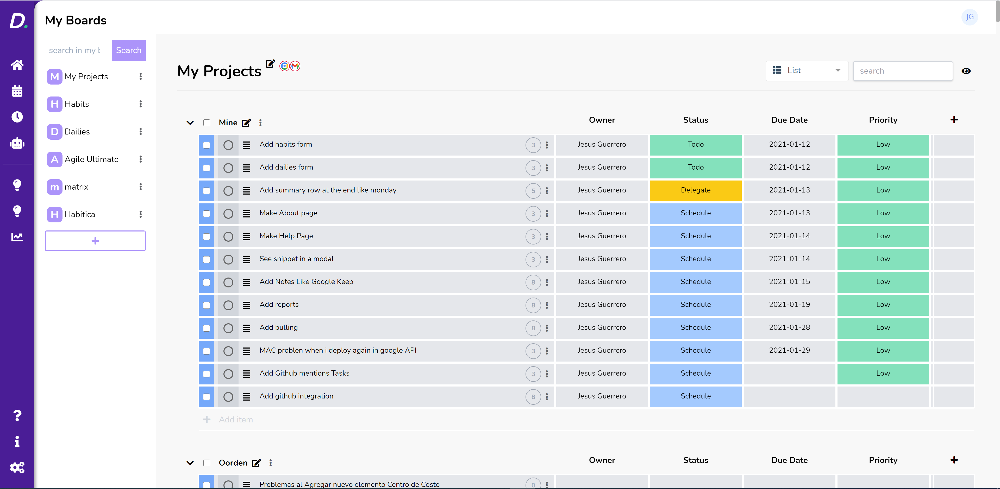

# IC-Daily (codename: Sunday) 
Monolith app using laravel 9, jetstream, intertia and Vue.

ICDaily is a productivity web app to help you keep your tasks, track your time, using pomodoro inspired on Monday.


## The goals

* **EASY and Fast** Provide an easy way to keep your taks assing priorities and track your time using pomodoro.

* **One to rule them all** Promodoro timer, Toggl tracker, Eisenhower matrix and Monday Automations

> This will be like Monday but more chulo
 
## Features

* Agenda
* Time Tracker
* Pomodoro
* Task Board
* Automations 
* Gmail and Calendar integration
* Developer focused
* List / Board layout
* And more...


> You'll use real checkboxes not images

## Captures


## Motivation 
Back in the day I was working in a project that had strong communication via Gmail, I set up an automation in Monday to load emails and map them into tasks. My free trial ended and [Jetstream](https://jetstream.laravel.com/2.x/introduction.html) was released. It was the perfect time to clone and see what new things Jetstream bring to laravel and extend Moday functionality all at the same time (or just an excuse for other side project?). 

## Sunday vs Zen
If you noticed I have another similar productivity app called [Zen](https://zenboard.app/) in fact, Zen is is extracted from Sunday to be a more personal, minimal and lightweight version of it but as features were rolling out the differences were bigger they are antitesis from one another.

Sunday is a self-hosted general purpose productivity app inspired in Monday. with the support for Teams, Members, Spaces (Coming soon?), Integrations with Gmail and Calendar is more focused in Job relared activities.

Zen aims to be a flow, another dimension you unblocking your productivity chackras and facing Enlightenment ⛩️, na, just kidding. But seriously it is an unique opinionated behavior on how to be productive in a personal level. It is the relation between me(the user), my goals and my time. The is a work in process on how to connect it with a bigger picture(Projects, Plans, Habits).

## Installation

### Prerequisites

| Prerequisite                                          | Version     |
| ------------------------------------------------------| ----------  |
| [Node.js](http://nodejs.org)                          | `~ ^16.18.0`|
| npm (comes with Node) or yarn (used)                  | `~ ^5`      |
| [PHP]                                                 | `~ ^8.1.2`  |
| [Cloud Platform Project (with Gmail API)**](https://developers.google.com/gmail/api/quickstart/js)                                |    --                                                 |             |
| PHP extension ext-mailparse**                         |      --     |

`** those requirements are optional if you want to use gmail and calendar integration`

```shell
node -v
```

#### Cloning the repo

1. Open a Terminal in your projects directory 
2. Clone this repo

```shell
$ git clone https://github.com/jesusantguerrero/sunday.git

```
### Setup

copy .env.example to .env:

```bash
# Remember place your laravel-app info there:
cp .env.example .env

```

Setup 
```bash
# composer install
composer install --ignore-platform-reqs
# generate key
php artisan key:generate
# run migrations
php artisan migrate
# run seeds
php artisan db:seed
```

Frontend development
```bash
# install npm packages
npm install
# development
npm run dev
```

## Related projects
- [Zen](https://zenboard.app/)

## Other self-hosted projects
- [Loger](https://github.com/jesusantguerrero/atmosphere)


## License
[MIT license](https://opensource.org/licenses/MIT).
