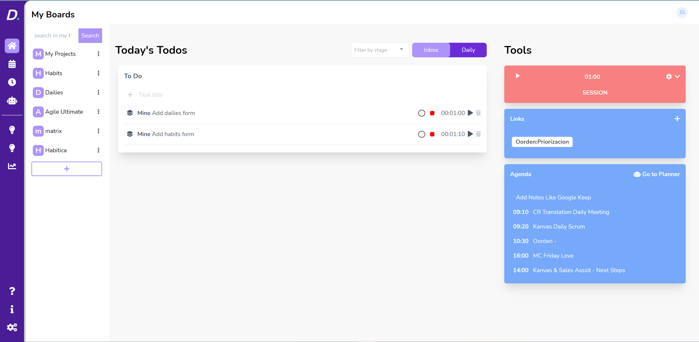
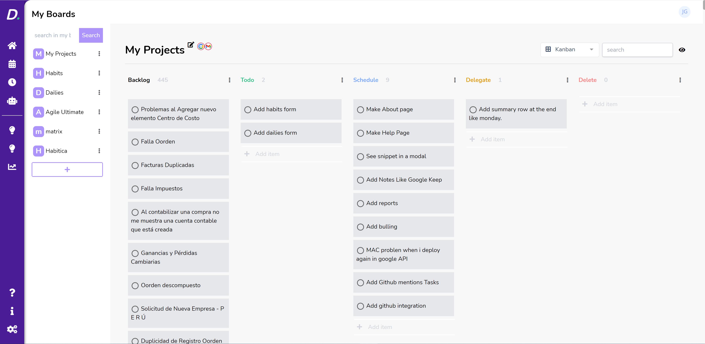

# IC Daily

A simple productivity web app to help you keep your tasks, track your time, using promodoro and heisenhower matrix.

## The goals

* **EASY and Fast** Provide an easy way to keep your taks assing priorities and track your time using promodoro.

* **One to rule them all** Promodoro timer, Toggl tracker, Heisenhower matrix and Monday Automations

> This will be like Monday but more chulo
 
## Features

* Agenda (Can connect with Google Calendar)
* Time Tracker
* Promodor
* Task Board (Can connect with Gmail)
* Developer focused
* And more...

> You'll use real checkboxes not images

TODO:
- Table of content
- Drag and drop images to the editor

## Technologies

* HTML/CSS/ JavaScript
* And some helpfull [npm modules]()

## Captures

## License

Copyright (c) Insane Code. All rights reserved.

Licensed under the MIT License.
